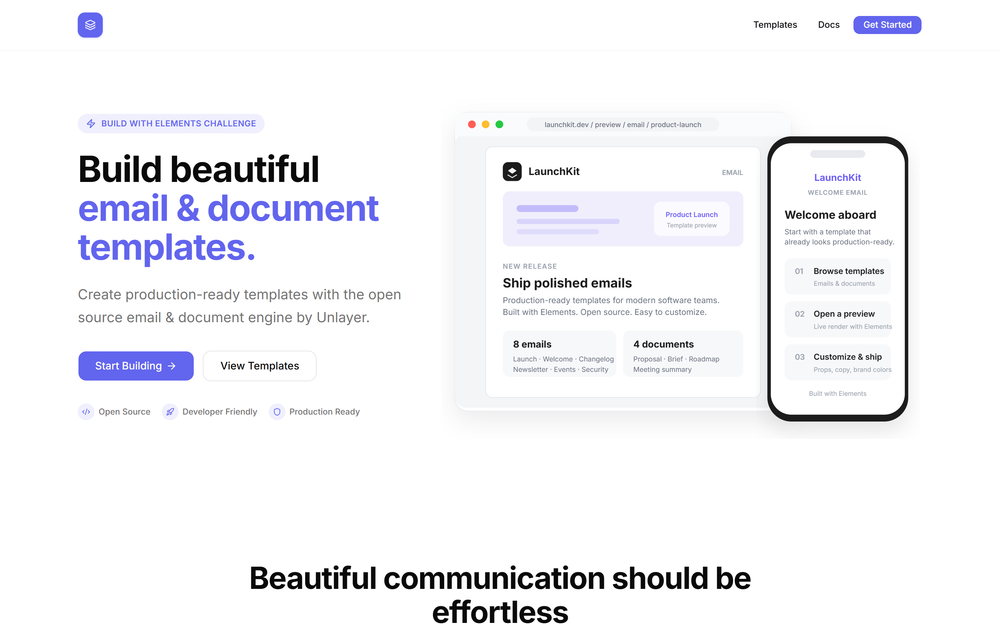
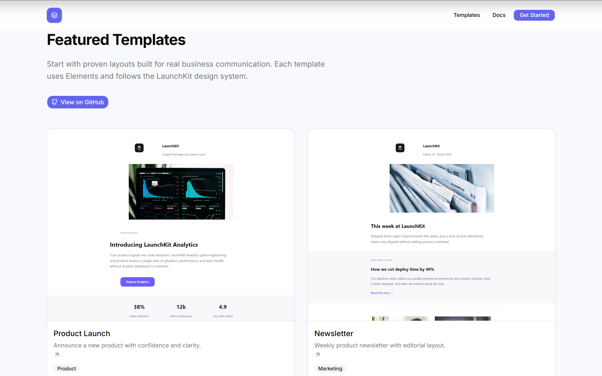
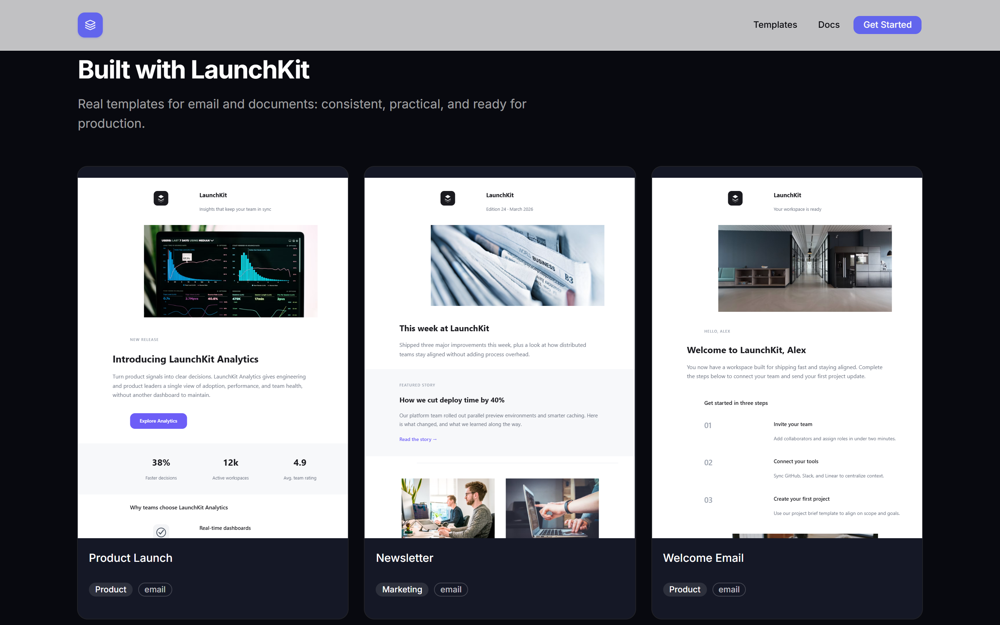
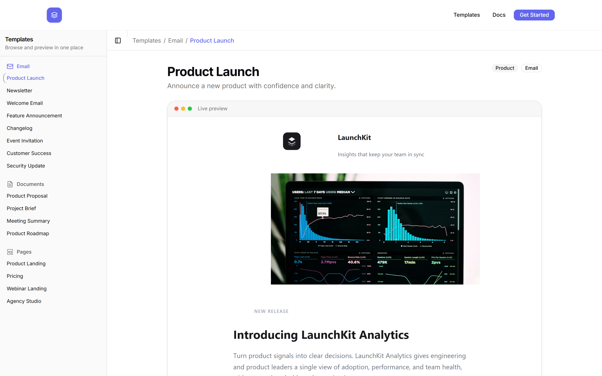
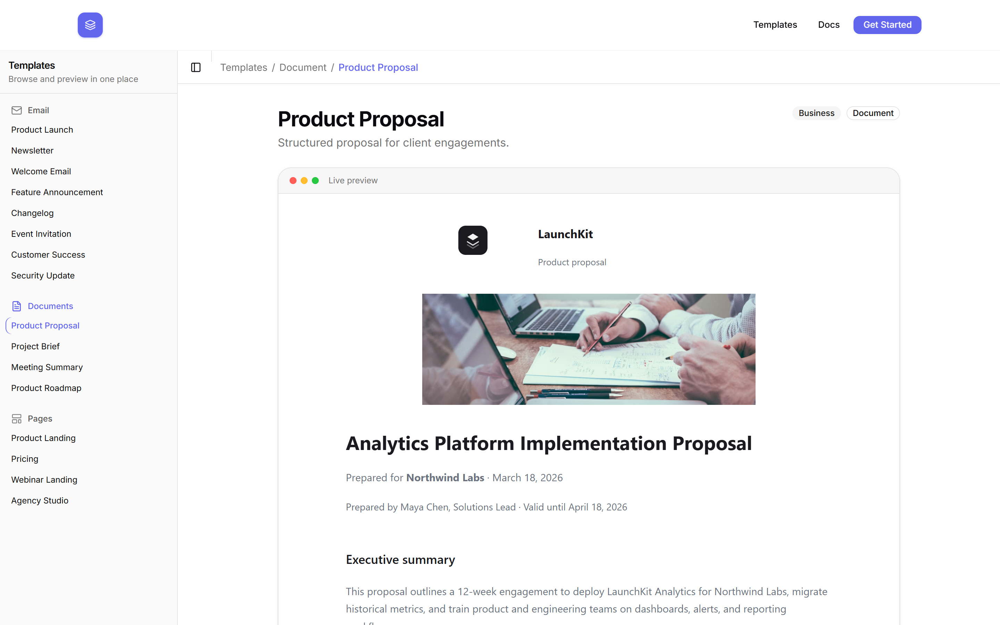
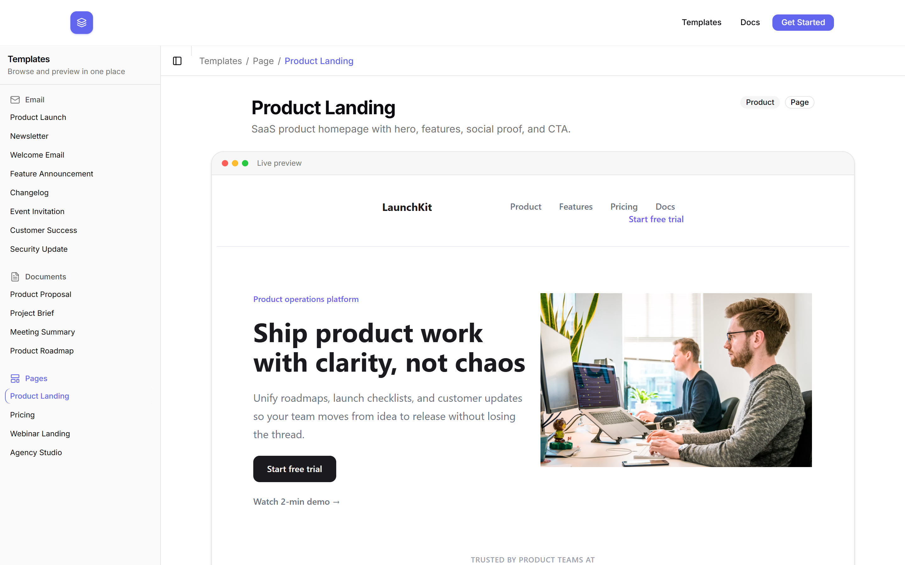
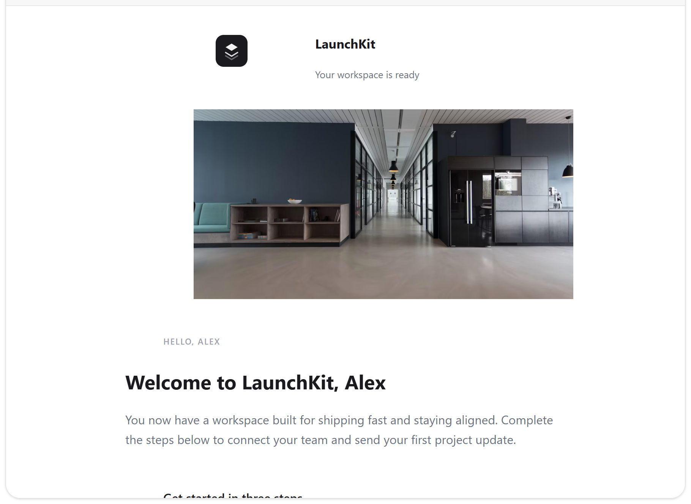

# LaunchKit

**Professional email, document, and page templates for modern software teams.**

Beautiful communication should be effortless.

[](https://github.com/ansuofficial/launchkit/actions/workflows/ci.yml)
[](./LICENSE)
[](https://unlayer.com/elements)

<p align="center">
  
</p>

LaunchKit is a premium open-source collection of production-ready templates built with [Elements](https://unlayer.com/elements) (`@unlayer/react-elements`). One design system. Sixteen templates. Live previews. Exportable HTML.

> **Challenge:** Build With Elements Challenge 2026 · `#BuiltWithElements`

---

## Why LaunchKit

| | |
|---|---|
| **16 templates** | 8 email · 4 document · 4 page |
| **Live previews** | Browse and inspect every layout in-app |
| **Shared system** | Headers, CTAs, footers, and tokens stay consistent |
| **Ship-ready HTML** | `renderToHtml` + plain text for any ESP |
| **No backend** | Clone, customize, export. No auth or CMS |

---

## Gallery

### Landing

<p align="center">
  
</p>

<p align="center">
  
</p>

### Browse and preview

<p align="center">
  
</p>

### Templates up close

| Email | Document | Page |
|:---:|:---:|:---:|
|  |  |  |
| **Product Launch** | **Product Proposal** | **Product Landing** |

<p align="center">
  
  <br />
  <sub>Welcome email · isolated template frame</sub>
</p>

---

## Quick start

```bash
git clone https://github.com/ansuofficial/launchkit.git
cd launchkit
npm install
npm run dev
```

Open [http://localhost:3000](http://localhost:3000).

| Route | What you get |
|-------|----------------|
| `/` | Landing page |
| `/templates` | Browse (redirects to first template) |
| `/templates/email/<slug>` | Email preview |
| `/templates/document/<slug>` | Document preview |
| `/templates/page/<slug>` | Page preview |

```bash
npm run smoke        # Render every template (CI gate)
npm run export-html  # Write HTML to public/exports/
npm run build        # Production build
```

Requires **Node.js 20+** (see `.nvmrc`). This repo is not published to npm (`private: true`). Clone it as a template library.

---

## Template catalog

<details>
<summary><strong>Email (8)</strong></summary>

| Template | Slug | Category |
|----------|------|----------|
| Product Launch | `product-launch` | Product |
| Welcome Email | `welcome` | Product |
| Feature Announcement | `feature-announcement` | Product |
| Changelog | `changelog` | Product |
| Newsletter | `newsletter` | Marketing |
| Event Invitation | `event-invitation` | Marketing |
| Customer Success | `customer-success` | Marketing |
| Security Update | `security-update` | Product |

</details>

<details>
<summary><strong>Document (4)</strong></summary>

| Template | Slug | Category |
|----------|------|----------|
| Product Proposal | `product-proposal` | Business |
| Project Brief | `project-brief` | Business |
| Meeting Summary | `meeting-summary` | Business |
| Product Roadmap | `product-roadmap` | Product |

</details>

<details>
<summary><strong>Page (4)</strong></summary>

| Template | Slug | Category |
|----------|------|----------|
| Product Landing | `product-landing` | Product |
| Pricing | `pricing` | Marketing |
| Webinar Landing | `webinar` | Marketing |
| Agency Studio | `agency` | Business |

</details>

Each template lives in:

```
src/templates/<type>/<slug>/
  index.tsx    # Elements component
  preview.tsx  # Sample props
```

Register new ones in `src/lib/templates.ts`.

---

## Architecture

```
src/
├── app/                 # Landing, browse, previews
├── components/          # shadcn UI (web app only)
├── elements/shared/     # Reusable Elements blocks
├── templates/           # email | document | page
└── lib/
    ├── templates.ts     # Registry
    ├── render.ts        # renderToHtml / plain text
    └── preview-html.ts  # Safe iframe prep
```

**Boundary:** Tailwind and shadcn are for the web app only. Never use them inside `<Email>`, `<Document>`, or `<Page>` trees.

---

## Render HTML

```ts
import { ProductLaunchEmail } from "@/templates/email/product-launch";
import { productLaunchPreview } from "@/templates/email/product-launch/preview";
import {
  renderTemplateToHtml,
  renderTemplateToPlainText,
} from "@/lib/render";

const html = renderTemplateToHtml(ProductLaunchEmail(productLaunchPreview));
const text = renderTemplateToPlainText(ProductLaunchEmail(productLaunchPreview));
```

Batch export:

```bash
npm run export-html
# public/exports/email/*.html
# public/exports/document/*.html
# public/exports/page/*.html
```

Customize by editing props in `preview.tsx` (or your own object) and re-rendering. Tokens live in `src/elements/shared/constants.ts` and [design-system.md](./design-system.md).

---

## Send with Resend

LaunchKit does not send mail. It produces HTML you pass to any ESP:

```ts
import { Resend } from "resend";
import { WelcomeEmail } from "@/templates/email/welcome";
import { renderTemplateToHtml, renderTemplateToPlainText } from "@/lib/render";

const resend = new Resend(process.env.RESEND_API_KEY);

await resend.emails.send({
  from: "You <onboarding@yourdomain.com>",
  to: "user@example.com",
  subject: "Welcome aboard",
  html: renderTemplateToHtml(WelcomeEmail({ /* props */ })),
  text: renderTemplateToPlainText(WelcomeEmail({ /* props */ })),
});
```

Works the same with Postmark, SendGrid, SES, and others.

---

## Contributing

1. Fork / branch from `main`
2. Keep PRs focused (`feat/`, `fix/`, `docs/`)
3. Run `npm run lint`, `typecheck`, and `smoke` before opening a PR

Read [CONTRIBUTING.md](./CONTRIBUTING.md) · [CODE_OF_CONDUCT.md](./CODE_OF_CONDUCT.md) · [SECURITY.md](./SECURITY.md) · [Agents.md](./Agents.md)

### Regenerate README screenshots

With the app running (`npm run build && npm run start`):

```bash
npm run screenshots
```

Assets land in `public/images/readme/` (2x, 1440×900 viewport).

---

## License

[MIT](./LICENSE)

## Credits

- [Elements](https://unlayer.com/elements) by [Unlayer](https://unlayer.com)
- [shadcn/ui](https://ui.shadcn.com)
- [Lucide](https://lucide.dev)

**#BuiltWithElements**
