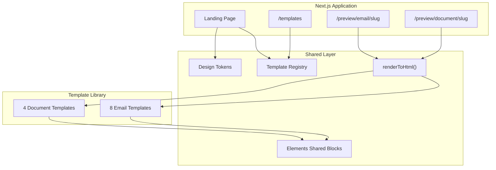

# LaunchKit — Implementation Plan

> Step-by-step roadmap for building LaunchKit. Review this plan before starting application code.
>
> **Agent guidance:** [Agents.md](./Agents.md)  
> **Source docs:** [prd.md](./prd.md) · [pid.md](./pid.md) · [design-system.md](./design-system.md)

---

## Overview

**Project:** LaunchKit — premium email & document templates for modern software teams  
**Challenge:** Build With Elements Challenge 2026 (deadline: July 31, 2026)  
**Stack:** Next.js 15 · TypeScript · shadcn/ui · Tailwind CSS · `@unlayer/react-elements`

**Deliverables:**

- 1 landing page (screenshot-inspired layout)
- 8 email templates
- 4 document templates
- Professional GitHub README with screenshots and GIF

**Visual target:** Reference screenshot layout — light hero, featured templates with section header, value props, dark preview gallery. **Exclude** the challenge sidebar (context only).

---

## Architecture



---

## Phase 0 — Project Foundation

**Goal:** Runnable Next.js project with dependencies and folder scaffold.

### Tasks

1. Initialize Next.js 15 with App Router, TypeScript, Tailwind, ESLint
   ```bash
   npx create-next-app@latest . --typescript --tailwind --eslint --app --src-dir
   ```

2. Install dependencies
   ```bash
   npm install @unlayer/react-elements lucide-react
   ```

3. Configure fonts via `next/font` — Inter (primary), optional Geist

4. Create folder structure per [Agents.md](./Agents.md#folder-structure)

5. Add root files:
   - `LICENSE` (MIT)
   - `.gitignore` (standard Next.js + `.env*`)
   - Update `package.json` scripts: `dev`, `build`, `start`, `export-html`

6. Initialize git repository and first commit

### Design token setup (initial)

Extend `tailwind.config.ts` with tokens from [design-system.md](./design-system.md):

| Token | Value |
|-------|-------|
| `lk-bg-primary` | `#08090F` |
| `lk-bg-secondary` | `#0F111A` |
| `lk-bg-surface` | `#151826` |
| `lk-accent` | `#6D5EF7` |
| `lk-accent-secondary` | `#8B7CFF` |
| `lk-accent-blue` | `#5EA8FF` |
| `lk-accent-highlight` | `#BFA7FF` |

Spacing: extend with `8, 16, 24, 32, 48, 64, 96`.  
Radii: `card: 20px`, `button: 14px`, `input: 12px`.  
Max width: `1280px` container.

### Checkpoint

- [x] `npm run dev` serves without errors
- [x] Fonts load correctly
- [x] Tailwind tokens available in a test component
- [x] Folder structure matches Agents.md

---

## Phase 1 — Design System in Code (shadcn/ui)

**Goal:** shadcn/ui configured with LaunchKit design tokens. No custom UI primitives.

### Tasks

1. Create `src/styles/tokens.css` — CSS custom properties mirroring design system
2. Create `src/styles/globals.css` — base resets + shadcn CSS variables mapped to LaunchKit tokens
3. Initialize shadcn/ui:
   ```bash
   npx shadcn@latest init
   ```
4. Add core shadcn components:
   ```bash
   npx shadcn@latest add button card badge separator
   ```
5. Theme shadcn variables to LaunchKit palette (`--primary` → `#6D5EF7`, radii per design-system.md)
6. Create thin layout helpers in `src/components/landing/` only when shadcn has no equivalent (`Container`, `Section`)
7. Optional: `/design-system` dev route showcasing themed shadcn components

### shadcn component map (default for all web UI)

| Need | shadcn component |
|------|------------------|
| Buttons / CTAs | `Button` |
| Cards / panels | `Card` |
| Labels / tags | `Badge` |
| Dividers | `Separator` |

### Checkpoint

- [x] shadcn/ui initialized in `src/components/ui/`
- [x] Button, Card, Badge render with LaunchKit purple accent
- [x] Theme uses design-system tokens (no arbitrary colors)
- [x] No bespoke Button/Card/Badge in `src/components/`

---

## Phase 2 — Shared Elements Foundation

**Goal:** Reusable Elements blocks and render pipeline.

### Tasks

1. Create `src/lib/render.ts`
   ```typescript
   // Wrappers for renderToHtml, renderToPlainText
   // Accept React element, return HTML string
   ```

2. Create `src/lib/templates.ts` — template registry
   ```typescript
   // { slug, name, category, type: 'email' | 'document', featured?: boolean }
   ```

3. Build shared Elements blocks in `src/elements/shared/`:
   - `BrandHeader.tsx` — logo area + optional tagline
   - `FooterBlock.tsx` — links, unsubscribe, address
   - `CTAButton.tsx` — purple CTA with consistent styling
   - `DividerSection.tsx` — horizontal rule with spacing
   - `FeatureList.tsx` — icon + text feature rows

4. Create minimal proof-of-concept email at `src/templates/email/hello/index.tsx`

5. Create preview route `src/app/preview/email/[slug]/page.tsx`
   - Server component calls `renderToHtml()`
   - Renders HTML in sandboxed iframe
   - Preview chrome (toolbar, back link) uses **shadcn** `Button` + `Card`

### Email defaults (document in code comments)

- `contentWidth`: `600px`
- `backgroundColor`: `#F8F9FC` (outer), `#FFFFFF` (content rows)
- CTA `backgroundColor`: `#6D5EF7`
- Font: Inter stack

### Checkpoint

- [x] Hello email renders via `/preview/email/hello`
- [x] `renderToHtml()` produces valid HTML (no console errors)
- [x] Shared blocks compose without hierarchy violations
- [x] Template registry structure is in place

---

## Phase 3 — Landing Page

**Goal:** Full landing page matching reference screenshot layout.

### Section build order

#### 1. Nav (`Nav.tsx`)

- LaunchKit logo (text or SVG mark)
- Minimal links: Templates, GitHub
- Sticky or static top bar, light background

#### 2. Hero (`Hero.tsx`)

- Badge: "Built with Elements" or challenge pill
- Headline: e.g. "Professional templates for modern teams." (purple accent on key word)
- Subtext: one sentence on what LaunchKit provides
- CTAs: "Start Building" (primary) + "View Templates" (secondary)
- Trust pills: Open Source · Developer Friendly · Production Ready

#### 3. Featured Templates (`FeaturedTemplates.tsx`) — **required structure**

```
FeaturedSectionHeader
├── h2: "Featured Templates" (or similar)
├── p:  1–2 sentence description
└── Button: "View on GitHub" + GitHub icon

[48px gap]

FeaturedTemplateCard × 2
├── Template preview (screenshot or live render)
├── Name badge
└── Link → /preview/email/<slug>
```

**Spacing spec:**

| Element | Spacing |
|---------|---------|
| Section vertical padding | 64px |
| Title → description | 24px |
| Description → GitHub CTA | 32px |
| Header block → card grid | 48px |
| Gap between cards | 32px |

**Components to create:**

- `src/components/landing/FeaturedSectionHeader.tsx`
- `src/components/landing/FeaturedTemplateCard.tsx`
- `src/components/landing/FeaturedTemplates.tsx`

#### 4. Why LaunchKit (`WhyLaunchKit.tsx`)

Three value cards (reference: Ship Faster / Scale Smarter / Stay Secure):

- Icon (Lucide) + title + one-line description
- Light background, 3-column desktop / stacked mobile

#### 5. Trust Row (`TrustRow.tsx`)

- "Trusted by" or "Built for teams like" label
- Logo strip (styled text marks or placeholder logos)
- Subtle, not dominant

#### 6. Preview Gallery (`PreviewGallery.tsx`)

- **Dark background:** `#08090F`
- Heading: "Built with LaunchKit" + subtitle
- Horizontal scroll or responsive grid of all 12 template preview cards
- Each card: thumbnail, template name, category badge
- Link to preview route

#### 7. GitHub CTA (`GitHubCTA.tsx`)

- Full-width band (light or subtle purple tint)
- Reinforces repo link — distinct from Featured header CTA
- Copy: e.g. "Star LaunchKit on GitHub" + button

#### 8. Footer (`Footer.tsx`)

- Links: Templates, GitHub, Elements docs
- Acknowledgement: Built with Elements by Unlayer
- MIT license note

### Landing page composition (`src/app/page.tsx`)

```tsx
<Nav />
<Hero />
<FeaturedTemplates />
<WhyLaunchKit />
<TrustRow />
<PreviewGallery />
<GitHubCTA />
<Footer />
```

### Responsive breakpoints

| Breakpoint | Behavior |
|------------|----------|
| `< 768px` | Single column, stacked cards, reduced padding (48px sections) |
| `768px – 1024px` | 2-column featured cards, 2-column value props |
| `> 1024px` | Full layout, 1280px max container |

### Checkpoint

- [ ] Featured section has title + description + GitHub CTA above cards
- [ ] Two showcase cards display with preview thumbnails
- [ ] Dark gallery section uses `#08090F`
- [ ] Responsive at 375px and 1280px
- [ ] No challenge sidebar present
- [ ] Subtle animations only (≤ 250ms)

---

## Phase 4 — Email Templates (8)

**Goal:** Production-ready email templates using Elements.

### Build order (priority)

| # | Template | Slug | Featured? |
|---|----------|------|-----------|
| 1 | Product Launch | `product-launch` | Yes (card 1) |
| 2 | Newsletter | `newsletter` | Yes (card 2) |
| 3 | Welcome Email | `welcome` | |
| 4 | Feature Announcement | `feature-announcement` | |
| 5 | Changelog | `changelog` | |
| 6 | Event Invitation | `event-invitation` | |
| 7 | Customer Success | `customer-success` | |
| 8 | Security Update | `security-update` | |

### Per-template workflow

1. Create `src/templates/email/<slug>/index.tsx`
2. Create `src/templates/email/<slug>/preview.tsx` (sample data)
3. Register in `src/lib/templates.ts`
4. Verify preview at `/preview/email/<slug>`
5. Export static HTML via `scripts/export-html.ts`
6. Capture screenshot for README / gallery

### Quality gate (each template)

- [ ] Realistic business copy
- [ ] Uses shared Elements blocks
- [ ] Consistent spacing and typography
- [ ] `renderToHtml()` succeeds
- [ ] Presentation-ready

### Checkpoint

- [ ] All 8 emails preview correctly
- [ ] Featured templates (product-launch, newsletter) wired to landing cards
- [ ] Gallery shows all 8 email previews

---

## Phase 5 — Document Templates (4)

**Goal:** Production-ready document templates using `<Document>` wrapper.

### Templates

| # | Template | Slug | Category |
|---|----------|------|----------|
| 1 | Product Proposal | `product-proposal` | Business |
| 2 | Project Brief | `project-brief` | Business |
| 3 | Meeting Summary | `meeting-summary` | Business |
| 4 | Product Roadmap | `product-roadmap` | Product |

### Per-template workflow

Same as Phase 4, but:
- Root wrapper: `<Document>` instead of `<Email>`
- Preview route: `/preview/document/<slug>`
- Print-friendly styles (page margins, page breaks where needed)

### Checkpoint

- [ ] All 4 documents preview correctly
- [ ] Gallery includes all 4 document previews
- [ ] Total template count: 12

---

## Phase 6 — Template Browse Page

**Goal:** `/templates` page for browsing by category.

### Tasks

1. Create `src/app/templates/page.tsx`
2. Group templates by PRD categories:
   - **Product:** Launch, Feature Release, Changelog, Roadmap, Security Update, Welcome
   - **Marketing:** Newsletter, Event Invitation, Customer Success
   - **Business:** Proposal, Brief, Meeting Summary
3. Category filter tabs or sections
4. Card grid linking to preview routes
5. Link from landing page "View Templates" CTA

### Checkpoint

- [ ] All 12 templates listed with correct categories
- [ ] Filter/navigation works
- [ ] Consistent card design with gallery section

---

## Phase 7 — GitHub Repository Polish

**Goal:** Exceptional GitHub presentation per [prd.md](./prd.md#github-readme).

### Tasks

1. Write professional `README.md`:
   - Hero banner (`public/images/hero-banner.png`)
   - Tagline and overview
   - Template gallery grid (screenshots)
   - Quick start (clone, install, dev)
   - Folder structure tree
   - Usage example (render an email)
   - GIF demo (`public/images/demo.gif`)
   - MIT license badge
   - Acknowledgements to Elements / Unlayer
   - Challenge hashtag: `#BuiltWithElements`

2. Create `scripts/export-html.ts` — batch export all templates to `public/exports/`

3. Capture assets:
   - Landing page screenshot (1280px and mobile)
   - Each template preview screenshot
   - GIF: scroll landing → click template → preview

4. Final `package.json` metadata (name, description, repository, license)

### Checkpoint

- [ ] README renders correctly on GitHub
- [ ] All screenshots are high quality (2x)
- [ ] GIF demonstrates the full flow
- [ ] Installation instructions work on fresh clone

---

## Phase 8 — Quality Assurance & Submission

**Goal:** Final polish and challenge submission.

### QA checklist

**Landing page:**
- [ ] Matches reference layout (light hero, featured header + cards, dark gallery)
- [ ] Featured section: title + description + GitHub CTA + 2 cards
- [ ] GitHub CTA in two places (featured header + bottom band)
- [ ] Responsive on mobile and desktop
- [ ] Lighthouse: Performance ≥ 90, Accessibility ≥ 90

**Templates:**
- [ ] All 12 render without Elements errors
- [ ] No placeholder copy or layouts
- [ ] Consistent design language across all templates
- [ ] Shared components used appropriately

**Repository:**
- [ ] Public GitHub repo
- [ ] MIT license
- [ ] Professional README
- [ ] Clean commit history

**Challenge submission:**
- [ ] Repo is public with clear README
- [ ] Submit via official Build With Elements form
- [ ] Share with `#BuiltWithElements`

### Checkpoint

- [ ] Full QA checklist passed
- [ ] Ready for submission before July 31, 2026

---

## Timeline Estimate

| Phase | Estimated effort |
|-------|------------------|
| Phase 0 — Foundation | 2–3 hours |
| Phase 1 — Design system | 3–4 hours |
| Phase 2 — Elements foundation | 3–4 hours |
| Phase 3 — Landing page | 6–8 hours |
| Phase 4 — Email templates | 12–16 hours |
| Phase 5 — Document templates | 8–10 hours |
| Phase 6 — Browse page | 2–3 hours |
| Phase 7 — GitHub polish | 4–6 hours |
| Phase 8 — QA & submission | 2–3 hours |
| **Total** | **~42–57 hours** |

---

## Review Gates

Do not proceed to the next phase until the current phase checkpoint is complete.

| After phase | Review question |
|-------------|-----------------|
| 0 | Does the project run? |
| 1 | Do primitives match design-system.md? |
| 2 | Does Elements rendering work? |
| 3 | Does the landing page match the screenshot layout? |
| 4–5 | Are templates presentation-ready? |
| 6 | Can users browse all templates? |
| 7 | Would you star this repo on GitHub? |
| 8 | Ready to submit? |

---

## File Creation Order (Documentation)

This plan was produced following:

1. [Agents.md](./Agents.md) — standards and rules (written first)
2. [plan.md](./plan.md) — this file (written second)
3. Application code — begins at Phase 0 after plan review

---

## Next Step

Begin **Phase 0 — Project Foundation** once this plan is approved. Follow [Agents.md](./Agents.md) for all implementation decisions.